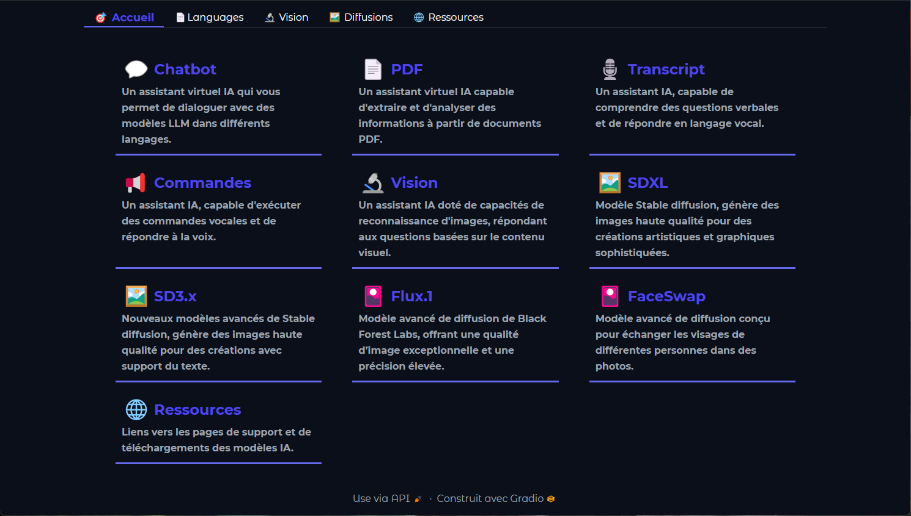
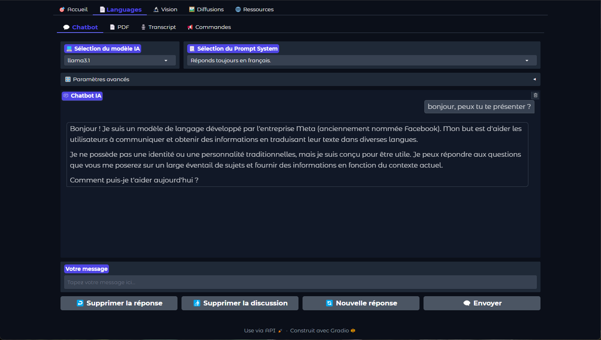
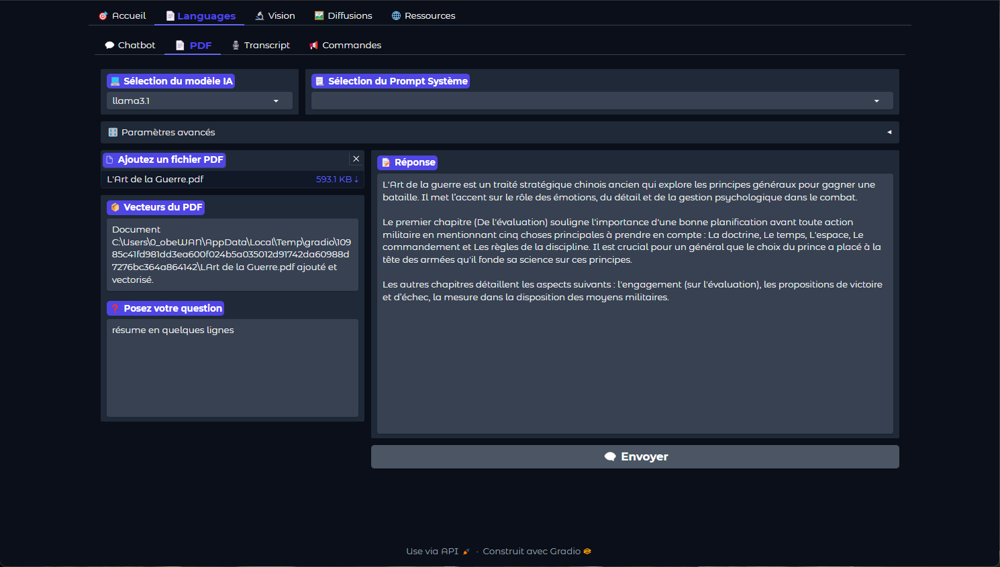
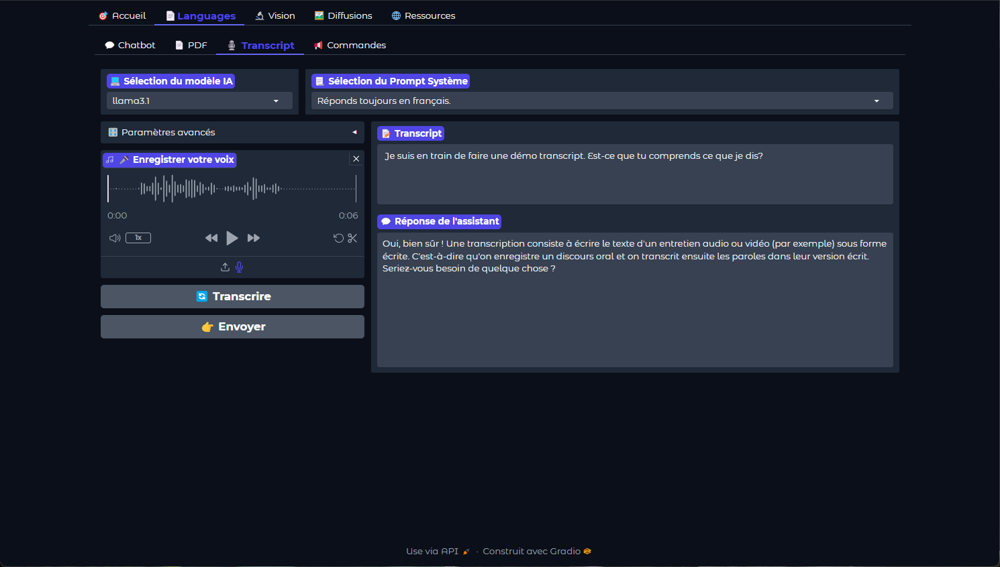
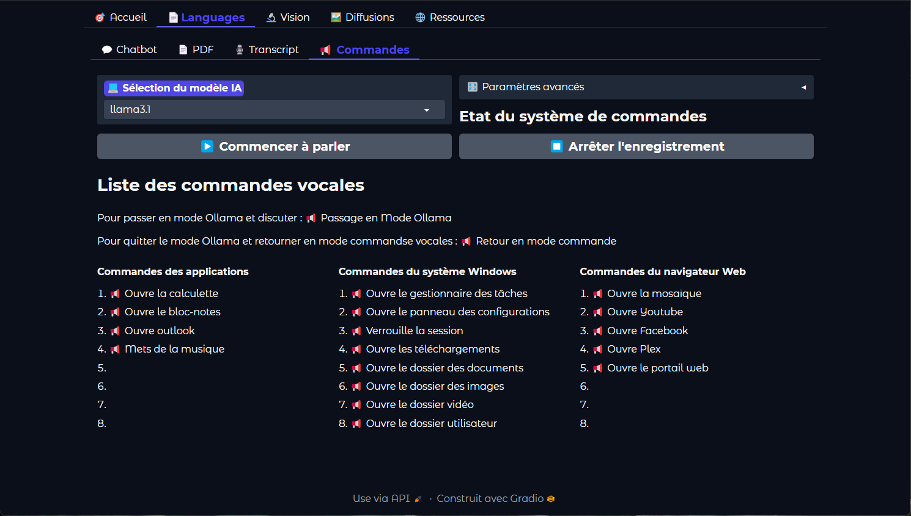
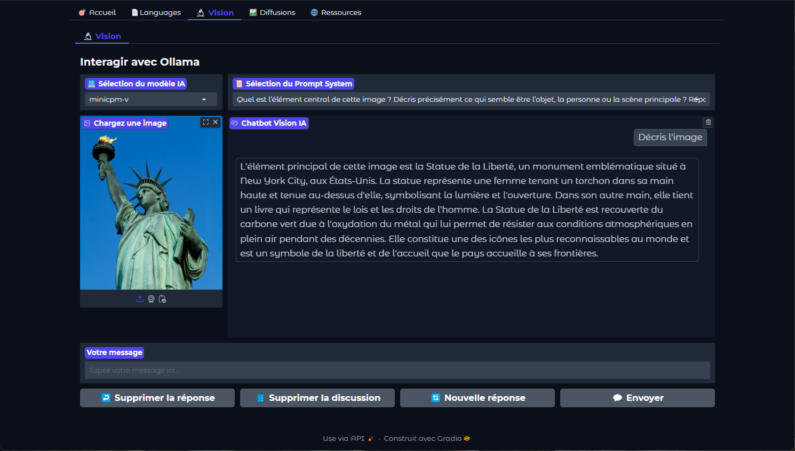
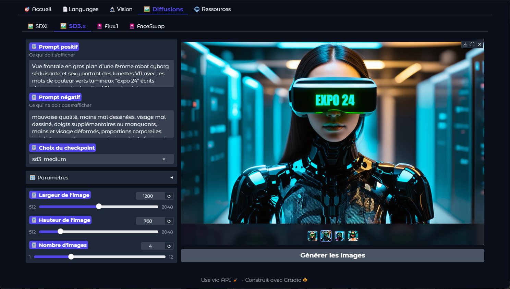
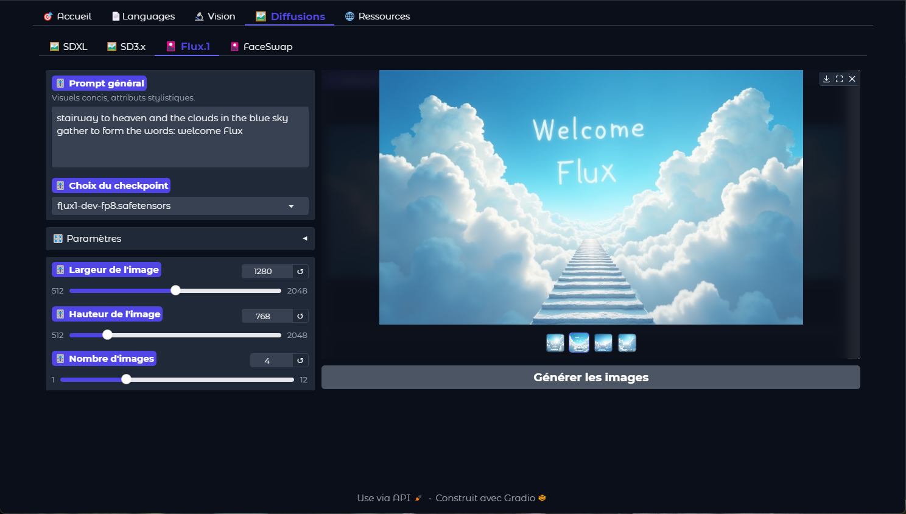
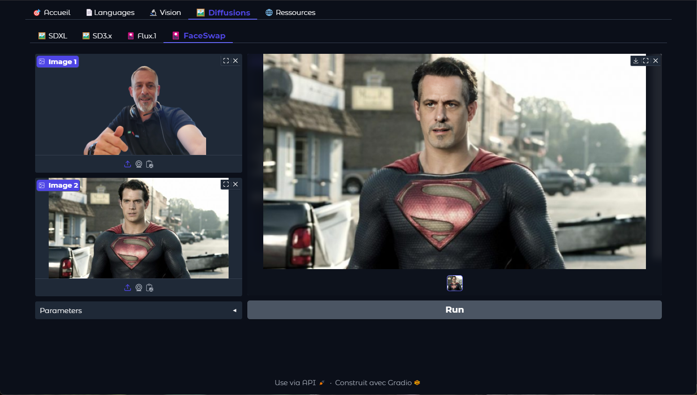
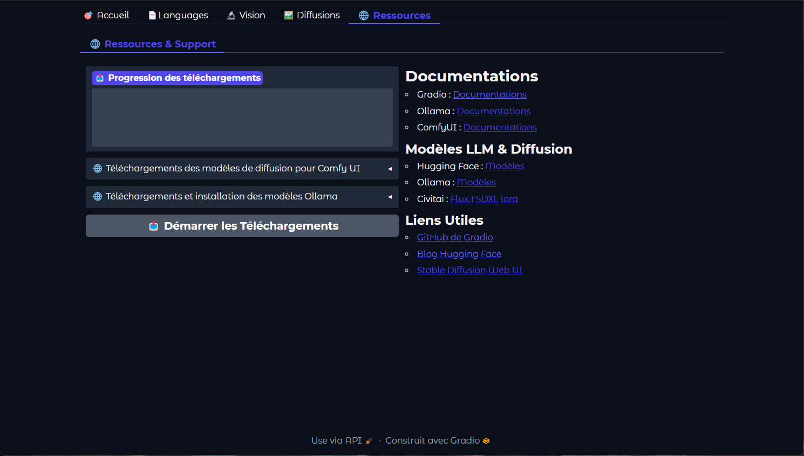

# eXtraLlama

## Description

Portail local UI Gradio pour Ollama & ComfyUI

- Chatbot
- PDF
- Transcript
- Commandes
- Vision
- Diffusions (SDXL/SD3.x/Flux1/FaceSwap)
- Ressources (Téléchargements)

### Portail



### Chatbot



### PDF



### Transcript



### Commandes



### Vision



### SDXL


### SD3.x



### Flux1



### FaceSwap



### Ressources



## Prérequis

- Windows 10/11 x64
- Python 3.10
- CUDA 11.8.0
- Visual Studio
- ComfyUI Portable (`%userprofile%\ComfyUI\ComfyUI`)
- Ollama

### Modèles Ollama

- Llama3.1
- minicpm-v
- llava
- llava-llama3
- nomic-embed-text
- Mistral
- qwen2.5-coder

### Modèles ComfyUI depuis l'onglet Ressources

#### Dans le dossier : `ComfyUI\ComfyUI\models\checkpoints`

- animaPencilXLv500.safetensors
- atomixXL_v40.safetensors
- copaxTimelessv12.safetensors
- dreamshaperXLv21.safetensors
- juggernautXL_v8Rundiffusion.safetensors
- leosamsHelloworldXL_helloworldXL70.safetensors
- Realistic5v5.safetensors
- samaritan3dCartoon_v40SDXL.safetensors
- sd3.5_large.safetensors
- sd3.5_large_fp8_scaled.safetensors
- sd3.5_medium.safetensors
- sd3_medium.safetensors

#### Dans le dossier : `ComfyUI\ComfyUI\models\clip`

- clip_g.safetensors
- clip_l.safetensors
- t5xxl_fp8_e4m3fn.safetensors
- t5xxl_fp16.safetensors
- ViT-L-14.pt

#### Dans le dossier : `ComfyUI\ComfyUI\clip_vision`

- clip_vision_g.safetensors
- clip_vision_vit_h.safetensors

#### Dans le dossier : `ComfyUI\ComfyUI\controlnet`

- controlnet.safetensors
- fooocus_ip_negative.safetensors
- ip-adapter-plus_sdxl_vit-h.bin

#### Dans le dossier : `ComfyUI\ComfyUI\unet`

- flux1-dev.safetensors
- flux1-schnell.safetensors
- flux1-dev-fp8.safetensors

#### Dans le dossier : `ComfyUI\ComfyUI\upscale_models`

- 4xNMKDSuperscale.pt
- 8xNMKDSuperscale.pt
- fooocus_upscaler.bin

#### Dans le dossier : `ComfyUI\ComfyUI\vae`

- ae.safetensors
- sdxl_vae.safetensors

### Custom Nodes ComfyUI

#### Dans le dossier : `ComfyUI\ComfyUI\Custom_nodes`

- [ComfyUI-Manager](https://github.com/ltdrdata/ComfyUI-Manager)
- [comfyui-reactor-node](https://github.com/Gourieff/comfyui-reactor-node)

## Installation

1. **Télécharger le projet** :
   - Renommer le dossier `eXtraLlama` et le copier à la racine du dossier utilisateur : `%userfile%\eXtraLlama`

Ou bien

2. **Utiliser Git pour cloner le projet** :
   - Cloner le projet à la racine du dossier utilisateur : `%userprofile%\eXtraLlama`
     ```sh
     git clone https://github.com/SergeBertrand/eXtraLlama.git
     ```

Lancer une première fois le fichier `DEMARRER.bat` pour la création des icônes sur le bureau :
- Raccourci Portail IA eXtra Llama (Démarrer le portail et ouvre dans le navigateur)
- Raccourci ComfyUI (Ouvre ComfyUI dans le navigateur)
- Raccourci Diffusions ComfyUI (Ouvre le répertoire des images "Output")

Patientez le temps du téléchargement des fichiers requis. Vous pouvez suivre le démarrage dans le terminal `Portail.py`.

## Workflows ComfyUI

### Exemple de Workflow SDXL


### Exemple de Workflow SD3 Medium


### Exemple de Workflow SD3.5 Large


### Exemple de Workflow Flux


### Exemple de Workflow FaceSwap


## Contributions

Nous encourageons les contributions de la communauté pour améliorer ce projet. Si vous souhaitez contribuer, veuillez suivre ces étapes :

1. **Forker le dépôt** : Créez une copie de ce dépôt sur votre propre compte GitHub.
2. **Créer une branche** : Créez une nouvelle branche pour votre contribution.
3. **Faire des modifications** : Apportez vos modifications et améliorations.
4. **Soumettre une Pull Request** : Soumettez une Pull Request pour que vos modifications soient revues et fusionnées.

## Licence

Ce projet est distribué sous la licence MIT. Vous êtes libre d'utiliser, de modifier et de distribuer ce code à condition de conserver la mention de la licence originale. Pour plus de détails, consultez le fichier `LICENSE`.

 

 ## Remerciements

Un GRAND MERCI à toutes et tous :

- [Python](https://www.python.org/)
- [Gradio](https://gradio.app/)
- [Ollama](https://ollama.com/)
- [ComfyUI](https://github.com/comfyanonymous/ComfyUI)
- [Meta](https://about.facebook.com/meta/)
- [Mistral](https://mistral.ai/)
- [Stable Diffusion](https://stability.ai/)
- [Black Forest Labs](https://blackforestlabs.ai/)
- [Hugging Face](https://huggingface.co/)
- [Civitai](https://civitai.com/)
- [LMarena](https://lmarena.ai)
- [GitHub](https://github.com/)


Codé par 0_obeWAN pour Kaito avec ❤️+🧠 
